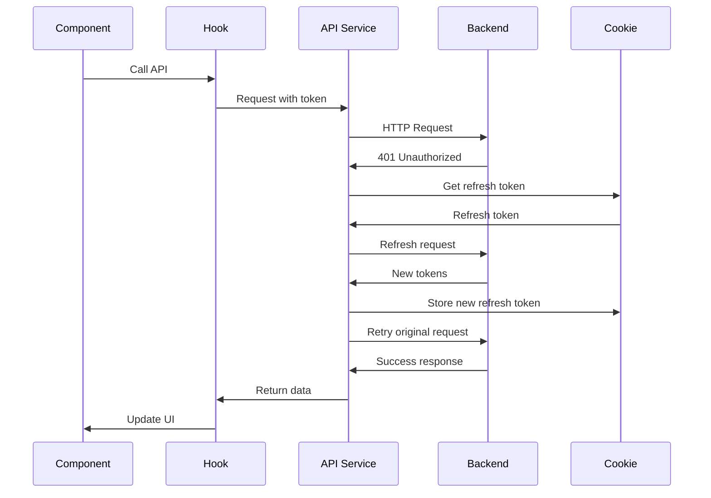

# API Integration Guide

## Overview

This guide explains how the frontend integrates with the backend API, including authentication, API structure, error handling, and best practices.

## API Configuration

### Base Setup

The API client is configured in `src/lib/api.ts`:

```typescript
import axios from "axios";

const api = axios.create({
  baseURL: process.env.NEXT_PUBLIC_BACKEND_URL,
  timeout: 20000, // 20 seconds
});

// Response interceptor for error handling
api.interceptors.response.use(
  (response) => response,
  (error) => {
    if (error.response && error.response.status === 401) {
      // Handle unauthorized access
    }
    return Promise.reject(error);
  }
);

export default api;
```

### Environment Variables

```env
NEXT_PUBLIC_BACKEND_URL=https://api.example.com/v1
```

---

## API Service Structure

All API calls are organized in `src/services/api/` by domain:

```
services/api/
├── auth.ts           # Authentication endpoints
├── product.ts        # Product management
├── order.ts          # Order management
├── inventory.ts      # Inventory/stock management
├── payment.ts        # Payment tracking
├── discount.ts       # Discount management
├── categories.ts     # Category management
├── user.ts           # User profile
├── user-address.ts   # Address management
├── wishlist.ts       # Wishlist operations
├── store.ts          # Store management
├── customization.ts  # Store customization
├── otp-token.ts      # OTP verification
└── paystack.ts       # Paystack integration
```

---

## Authentication API

### Endpoints

#### **Register User**
```typescript
POST /auth/register

// Request
interface IRegister {
  name: string;
  email: string;
  password: string;
  phoneNumber: string;
  role?: "buyer" | "seller";
}

// Response
{
  user: User;
  tokens: {
    access: { token: string; expires: string };
    refresh: { token: string; expires: string };
  };
}
```

#### **Login User**
```typescript
POST /auth/login

// Request
interface ILogin {
  email: string;
  password: string;
}

// Response
{
  user: User;
  tokens: {
    access: { token: string; expires: string };
    refresh: { token: string; expires: string };
  };
}
```

#### **Logout User**
```typescript
POST /auth/logout

// Request
{
  refresh: string;
  userId: string;
}

// Response
{
  message: "Logout successful";
}
```

#### **Forgot Password**
```typescript
POST /auth/forgot-password

// Request
{
  email: string;
}

// Response
{
  message: "Password reset email sent";
}
```

#### **Reset Password**
```typescript
POST /auth/reset-password?token={resetToken}

// Request
{
  password: string;
}

// Response
{
  message: "Password reset successful";
}
```

#### **Refresh Token**
```typescript
POST /auth/refresh-tokens

// Request
{
  refreshToken: string;
}

// Response
{
  access: { token: string; expires: string };
  refresh: { token: string; expires: string };
}
```

#### **Check Online Status**
```typescript
GET /auth/status
Authorization: Bearer {token}

// Response
{
  user: User;
  isOnline: boolean;
}
```

### Usage Example

```typescript
import { loginUser, registerUser } from "@/services/api/auth";

// Login
const { user, tokens } = await loginUser({
  email: "user@example.com",
  password: "password123"
});

// Register
const result = await registerUser({
  name: "John Doe",
  email: "john@example.com",
  password: "password123",
  phoneNumber: "+1234567890",
  role: "seller"
});
```

---

## Product API

### Endpoints

#### **Get All Products**
```typescript
GET /product
Authorization: Bearer {token}

// Response
Product[]
```

#### **Get Product Details**
```typescript
GET /product/detail/{productId}
Authorization: Bearer {token}

// Response
Product
```

#### **Get Store Products**
```typescript
GET /product/{userId}
Authorization: Bearer {token}

// Response
Product[]
```

#### **Get Related Products**
```typescript
GET /product/related/{productId}/{categoryId}
Authorization: Bearer {token}

// Response
Product[]
```

#### **Create Product**
```typescript
POST /product/{userId}
Authorization: Bearer {token}
Content-Type: multipart/form-data

// Request
interface IProduct {
  name: string;
  description: string;
  category: string;
  price: number;
  compareAtPrice?: number;
  images: File[];
  inventory: {
    quantity: number;
    sku: string;
    lowStockThreshold?: number;
  };
  variants: {
    name: string;
    options?: string[];
    price: number;
    quantity: number;
    sku: string;
  }[];
  specifications?: {
    name: string;
    value: string;
  }[];
}

// Response
Product
```

#### **Update Product**
```typescript
PATCH /product/{userId}/{productId}
Authorization: Bearer {token}
Content-Type: multipart/form-data

// Request
Partial<IProduct>

// Response
Product
```

#### **Delete Product**
```typescript
DELETE /product/{userId}/{productId}
Authorization: Bearer {token}

// Response
{
  message: "Product deleted successfully";
}
```

#### **Filter Products**
```typescript
GET /product/filter?name={searchTerm}

// Response
Product[]
```

### Usage Example

```typescript
import { createProduct, getProductDetails } from "@/services/api/product";

// Create product
const product = await createProduct({
  token: accessToken,
  userId: user.id,
  data: {
    name: "Product Name",
    description: "Product description",
    category: "category-id",
    price: 99.99,
    images: [file1, file2],
    inventory: {
      quantity: 100,
      sku: "SKU-001",
      lowStockThreshold: 10
    },
    variants: [],
    specifications: []
  }
});

// Get product details
const details = await getProductDetails(productId, accessToken);
```

---

## Order API

### Endpoints

#### **Get All Orders**
```typescript
GET /order
Authorization: Bearer {token}

// Response
Order[]
```

#### **Get User Orders**
```typescript
GET /order/{userId}
Authorization: Bearer {token}

// Response
Order[]
```

#### **Get Single Order**
```typescript
GET /order/{orderId}
Authorization: Bearer {token}

// Response
Order
```

#### **Create Order**
```typescript
POST /order
Authorization: Bearer {token}

// Request
interface Order {
  user: string;
  items: {
    product: string;
    variant?: string;
    quantity: number;
    price: number;
  }[];
  shippingAddress: Address;
  paymentMethod: string;
  totalAmount: number;
}

// Response
Order
```

#### **Cancel Order**
```typescript
PATCH /order/cancel/{orderId}
Authorization: Bearer {token}

// Response
Order
```

### Usage Example

```typescript
import { createOrder, getUsersOrder } from "@/services/api/order";

// Create order
const order = await createOrder({
  token: accessToken,
  data: {
    user: userId,
    items: cartItems,
    shippingAddress: address,
    paymentMethod: "paystack",
    totalAmount: 199.99
  }
});

// Get user orders
const orders = await getUsersOrder({
  token: accessToken,
  userId: user.id
});
```

---

## Inventory API

### Endpoints

#### **Get Stock History**
```typescript
GET /stock-history
Authorization: Bearer {token}

// Response
StockHistory[]
```

#### **Get Stock History by Product**
```typescript
GET /stock-history/product/{productId}
Authorization: Bearer {token}

// Response
StockHistory[]
```

#### **Create Stock Entry**
```typescript
POST /stock-history
Authorization: Bearer {token}

// Request
interface CreateStockData {
  product: string;
  type: "restock" | "refund" | "adjustment" | "return";
  quantity: number;
  previousStock: number;
  newStock: number;
  reference: string;
  referenceType: "manual" | "return" | "adjustment";
  referenceId: string | null;
  notes?: string;
  performedBy: string;
}

// Response
StockHistory
```

### Usage Example

```typescript
import { createStock, getStockHistory } from "@/services/api/inventory";

// Create stock entry
await createStock({
  token: accessToken,
  data: {
    product: productId,
    type: "restock",
    quantity: 50,
    previousStock: 10,
    newStock: 60,
    reference: "PO-001",
    referenceType: "manual",
    referenceId: null,
    notes: "Monthly restock",
    performedBy: userId
  }
});

// Get stock history
const history = await getStockHistory(accessToken);
```

---

## Discount API

### Endpoints

#### **Get All Discounts**
```typescript
GET /discount
Authorization: Bearer {token}

// Response
Discount[]
```

#### **Create Discount**
```typescript
POST /discount
Authorization: Bearer {token}

// Request
interface Discount {
  code?: string;
  type: "percentage" | "fixed";
  value: number;
  startDate: Date;
  endDate: Date;
  minimumPurchase?: number;
  maximumDiscount?: number;
  usageLimit: {
    perCustomer: number;
    total: number;
  };
  applicableTo: "all" | "category" | "product" | "variant";
  conditions: {
    categories?: string[];
    products?: string[];
    excludedProducts?: string[];
  };
  active: boolean;
}

// Response
Discount
```

#### **Update Discount**
```typescript
PATCH /discount/{discountId}
Authorization: Bearer {token}

// Request
Partial<Discount>

// Response
Discount
```

#### **Delete Discount**
```typescript
DELETE /discount/{discountId}
Authorization: Bearer {token}

// Response
{
  message: "Discount deleted successfully";
}
```

#### **Toggle Discount Status**
```typescript
PATCH /discount/{discountId}/status
Authorization: Bearer {token}

// Request
{
  active: boolean;
}

// Response
Discount
```

---

## Payment API

### Endpoints

#### **Get All Payments**
```typescript
GET /payment
Authorization: Bearer {token}

// Response
Payment[]
```

---

## Category API

### Endpoints

#### **Get All Categories**
```typescript
GET /category

// Response
Category[]
```

#### **Create Category**
```typescript
POST /category
Authorization: Bearer {token}

// Request
{
  name: string;
  description?: string;
  image?: File;
}

// Response
Category
```

#### **Update Category**
```typescript
PATCH /category/{categoryId}
Authorization: Bearer {token}

// Request
{
  name?: string;
  description?: string;
  image?: File;
}

// Response
Category
```

#### **Delete Category**
```typescript
DELETE /category/{categoryId}
Authorization: Bearer {token}

// Response
{
  message: "Category deleted successfully";
}
```

---

## Custom Hooks Integration

### Using React Query

All API calls are wrapped in custom hooks using React Query:

```typescript
// hooks/useProduct.tsx
import { useQuery, useMutation, useQueryClient } from "@tanstack/react-query";
import { getAllStoreProducts, createProduct } from "@/services/api/product";

export const useProducts = (token: string) => {
  return useQuery({
    queryKey: ["products"],
    queryFn: () => getAllStoreProducts(token),
    enabled: !!token,
  });
};

export const useCreateProduct = () => {
  const queryClient = useQueryClient();
  
  return useMutation({
    mutationFn: createProduct,
    onSuccess: () => {
      queryClient.invalidateQueries({ queryKey: ["products"] });
    },
  });
};
```

### Usage in Components

```typescript
"use client";

import { useProducts, useCreateProduct } from "@/hooks/useProduct";

export default function ProductList() {
  const { data: products, isLoading } = useProducts(token);
  const createMutation = useCreateProduct();
  
  const handleCreate = async (data: IProduct) => {
    await createMutation.mutateAsync({
      token,
      userId,
      data
    });
  };
  
  if (isLoading) return <div>Loading...</div>;
  
  return (
    <div>
      {products?.map(product => (
        <ProductCard key={product.id} product={product} />
      ))}
    </div>
  );
}
```

---

## Error Handling

### API Error Structure

```typescript
interface APIError {
  response: {
    status: number;
    data: {
      code: string;
      message: string;
      errors?: Record<string, string[]>;
    };
  };
}
```

### Error Handling Pattern

```typescript
import { toast } from "sonner";

try {
  const result = await createProduct(params);
  toast.success("Product created successfully");
} catch (error) {
  const apiError = error as APIError;
  
  if (apiError.response?.status === 401) {
    toast.error("Unauthorized. Please login again.");
    // Redirect to login
  } else if (apiError.response?.status === 400) {
    toast.error(apiError.response.data.message);
  } else {
    toast.error("An unexpected error occurred");
  }
}
```

---

## Authentication Flow

### Token Management



### Token Storage

- **Access Token**: Stored in memory (React state/Zustand)
- **Refresh Token**: Stored in HTTP-only cookie
- **Token Expiry**: Handled automatically by interceptors

---

## Best Practices

### 1. **Always Use Custom Hooks**
```typescript
// ✅ Good
const { data, isLoading } = useProducts(token);

// ❌ Bad
const [products, setProducts] = useState([]);
useEffect(() => {
  getAllStoreProducts(token).then(setProducts);
}, []);
```

### 2. **Handle Loading States**
```typescript
if (isLoading) return <Skeleton />;
if (error) return <ErrorMessage error={error} />;
if (!data) return null;
```

### 3. **Optimistic Updates**
```typescript
const mutation = useMutation({
  mutationFn: updateProduct,
  onMutate: async (newProduct) => {
    await queryClient.cancelQueries({ queryKey: ["products"] });
    const previous = queryClient.getQueryData(["products"]);
    queryClient.setQueryData(["products"], (old) => [...old, newProduct]);
    return { previous };
  },
  onError: (err, newProduct, context) => {
    queryClient.setQueryData(["products"], context.previous);
  },
});
```

### 4. **Type Safety**
```typescript
// Always define interfaces for API responses
interface Product {
  id: string;
  name: string;
  price: number;
  // ...
}

const getProducts = async (): Promise<Product[]> => {
  const response = await api.get("/product");
  return response.data;
};
```

### 5. **Error Boundaries**
```typescript
<ErrorBoundary fallback={<ErrorPage />}>
  <ProductList />
</ErrorBoundary>
```

---

## Testing API Integration

### Mock API Calls

```typescript
import { vi } from "vitest";
import { getAllStoreProducts } from "@/services/api/product";

vi.mock("@/services/api/product", () => ({
  getAllStoreProducts: vi.fn(),
}));

test("displays products", async () => {
  (getAllStoreProducts as jest.Mock).mockResolvedValue([
    { id: "1", name: "Product 1" },
  ]);
  
  // Test component
});
```

---

## API Versioning

The API uses versioning in the base URL:

```
https://api.example.com/v1/product
```

Future versions will be:
```
https://api.example.com/v2/product
```

---

## Rate Limiting

- **Rate Limit**: 100 requests per minute per IP
- **Headers**:
  - `X-RateLimit-Limit`: Maximum requests
  - `X-RateLimit-Remaining`: Remaining requests
  - `X-RateLimit-Reset`: Reset timestamp

---

## CORS Configuration

The backend must allow requests from the frontend domain:

```
Access-Control-Allow-Origin: https://yourfrontend.com
Access-Control-Allow-Methods: GET, POST, PATCH, DELETE
Access-Control-Allow-Headers: Authorization, Content-Type
Access-Control-Allow-Credentials: true
```

---

## Troubleshooting

### Common Issues

#### 1. **401 Unauthorized**
- Check if token is valid
- Verify token is being sent in headers
- Check if token has expired

#### 2. **CORS Errors**
- Verify backend CORS configuration
- Check if credentials are included
- Verify domain whitelist

#### 3. **Network Timeout**
- Check backend availability
- Verify timeout configuration (20s)
- Check network connectivity

#### 4. **400 Bad Request**
- Validate request payload
- Check required fields
- Verify data types

---

## Additional Resources

- [Axios Documentation](https://axios-http.com/)
- [React Query Documentation](https://tanstack.com/query/latest)
- [Next.js API Routes](https://nextjs.org/docs/app/building-your-application/routing/route-handlers)
