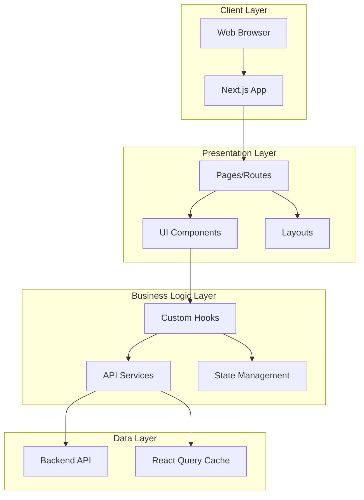
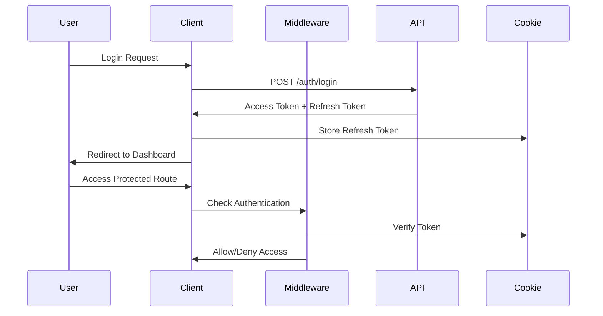
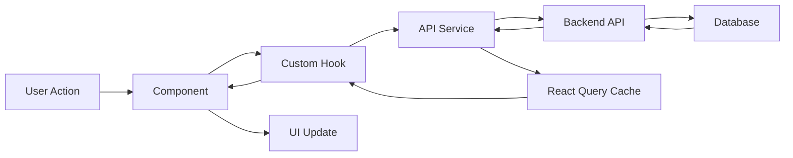
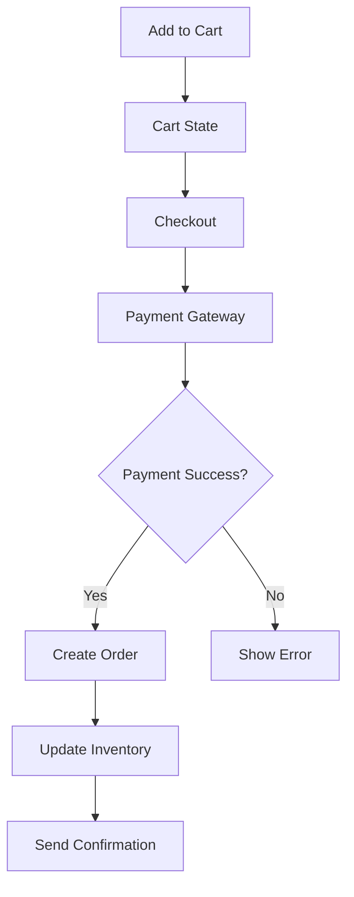

# Architecture Documentation

## System Architecture

The Multi-Store platform follows a modern, scalable architecture built on Next.js 15 with the App Router pattern.

## High-Level Architecture



## Architecture Patterns

### 1. **App Router Architecture**

The application uses Next.js 15's App Router with the following structure:

- **Server Components**: Default rendering strategy for better performance
- **Client Components**: Used for interactive UI elements
- **Layouts**: Shared UI across routes
- **Route Groups**: Organize routes without affecting URL structure

### 2. **Layered Architecture**

#### Presentation Layer
- **Pages**: Route-specific components in `src/app/`
- **Components**: Reusable UI components in `src/components/`
- **Layouts**: Shared layouts for different sections

#### Business Logic Layer
- **Custom Hooks**: Encapsulate business logic and API calls
- **Services**: API integration layer
- **Middleware**: Route protection and authentication

#### Data Layer
- **API Services**: HTTP client configuration and endpoints
- **State Management**: Global and local state handling
- **Caching**: React Query for server state caching

### 3. **Feature-Based Organization**

Each major feature is organized into its own module:

```
account/dashboard/
├── product-management/
│   ├── _component/
│   │   ├── columns.tsx
│   │   ├── data-table.tsx
│   │   └── product-form.tsx
│   └── page.tsx
├── order-management/
├── inventory-management/
└── ...
```

## Core Components

### 1. **Authentication System**



**Key Features:**
- JWT-based authentication
- HTTP-only cookies for refresh tokens
- Middleware-based route protection
- Automatic token refresh
- Role-based access control (buyer/seller)

### 2. **State Management**

The application uses a hybrid state management approach:

#### Global State (Zustand)
- User authentication state
- Shopping cart
- Theme preferences

#### Server State (React Query)
- Product data
- Order data
- Inventory data
- User data

**Benefits:**
- Automatic caching and revalidation
- Optimistic updates
- Background refetching
- Reduced boilerplate

### 3. **API Integration Layer**

```typescript
// Centralized API configuration
const api = axios.create({
  baseURL: process.env.NEXT_PUBLIC_BACKEND_URL,
  timeout: 20000,
});

// Service modules for each domain
- auth.ts       // Authentication
- product.ts    // Product management
- order.ts      // Order management
- inventory.ts  // Inventory tracking
- payment.ts    // Payment processing
- discount.ts   // Discount management
```

**Features:**
- Centralized error handling
- Request/response interceptors
- Type-safe API calls
- Automatic token injection

### 4. **Routing & Navigation**

```
/ (root)
├── /auth                    # Authentication
├── /shop                    # Product catalog
├── /product/[id]           # Product details
├── /checkout               # Checkout flow (protected)
├── /account                # User account (protected)
│   └── /dashboard          # Seller dashboard (protected)
│       ├── /product-management
│       ├── /order-management
│       ├── /stock-management
│       ├── /discount-management
│       ├── /category-management
│       ├── /payment-management
│       ├── /customers-management
│       └── /store-settings
└── /categories             # Category browsing
```

**Route Protection:**
- Middleware checks authentication status
- Redirects to `/auth` for protected routes
- Prevents authenticated users from accessing `/auth`

## Data Flow

### 1. **Product Management Flow**



### 2. **Order Processing Flow**



## Design Patterns

### 1. **Custom Hooks Pattern**

Encapsulate data fetching and business logic:

```typescript
// useProduct.tsx
export const useProduct = () => {
  const { data, isLoading, error } = useQuery({
    queryKey: ['products'],
    queryFn: () => getAllStoreProducts(token),
  });
  
  return { products: data, isLoading, error };
};
```

### 2. **Service Layer Pattern**

Separate API logic from components:

```typescript
// services/api/product.ts
export const createProduct = async (params) => {
  const response = await api.post(
    `/product/${params.userId}`,
    params.data,
    { headers: { Authorization: `Bearer ${params.token}` } }
  );
  return response.data;
};
```

### 3. **Compound Component Pattern**

Build flexible, composable UI components:

```typescript
<DataTable>
  <DataTableHeader />
  <DataTableBody />
  <DataTablePagination />
</DataTable>
```

### 4. **Provider Pattern**

Wrap app with necessary providers:

```typescript
<Providers>
  <QueryClientProvider>
    <ThemeProvider>
      <UserStatus>
        {children}
      </UserStatus>
    </ThemeProvider>
  </QueryClientProvider>
</Providers>
```

## Performance Optimizations

### 1. **Code Splitting**
- Dynamic imports for heavy components
- Route-based code splitting via Next.js
- Lazy loading of images

### 2. **Caching Strategy**
- React Query for server state caching
- Stale-while-revalidate pattern
- Optimistic updates for better UX

### 3. **Image Optimization**
- Next.js Image component
- Automatic format optimization (WebP)
- Responsive images with srcset

### 4. **Bundle Optimization**
- Turbopack for faster builds
- Tree shaking for unused code
- CSS purging via Tailwind

## Security Architecture

### 1. **Authentication Security**
- JWT tokens with expiration
- HTTP-only cookies for refresh tokens
- Secure token storage
- CSRF protection

### 2. **Authorization**
- Role-based access control
- Route-level protection via middleware
- API-level permission checks

### 3. **Data Validation**
- Zod schemas for form validation
- Server-side validation
- Type safety with TypeScript

### 4. **XSS Prevention**
- React's built-in XSS protection
- Content Security Policy headers
- Sanitized user inputs

## Scalability Considerations

### 1. **Horizontal Scaling**
- Stateless architecture
- API-first design
- Microservices-ready structure

### 2. **Caching**
- Client-side caching with React Query
- CDN for static assets
- API response caching

### 3. **Database Optimization**
- Pagination for large datasets
- Lazy loading of data
- Efficient queries

### 4. **Monitoring & Logging**
- Error boundaries for graceful failures
- Client-side error tracking
- Performance monitoring

## Technology Decisions

### Why Next.js 15?
- Server Components for better performance
- Built-in routing and middleware
- Excellent developer experience
- SEO-friendly SSR/SSG capabilities
- Turbopack for faster builds

### Why React Query?
- Automatic caching and revalidation
- Reduced boilerplate
- Optimistic updates
- Background refetching
- Better UX with loading states

### Why Zustand?
- Lightweight state management
- Simple API
- No boilerplate
- TypeScript support
- React 19 compatible

### Why Tailwind CSS?
- Utility-first approach
- Consistent design system
- Smaller bundle size
- Dark mode support
- Excellent developer experience

## Future Architecture Enhancements

1. **Micro-frontends**: Split dashboard into independent modules
2. **GraphQL**: Replace REST API for more efficient data fetching
3. **WebSockets**: Real-time order and inventory updates
4. **PWA**: Offline support and app-like experience
5. **Edge Functions**: Move some logic to edge for better performance
6. **A/B Testing**: Built-in experimentation framework
